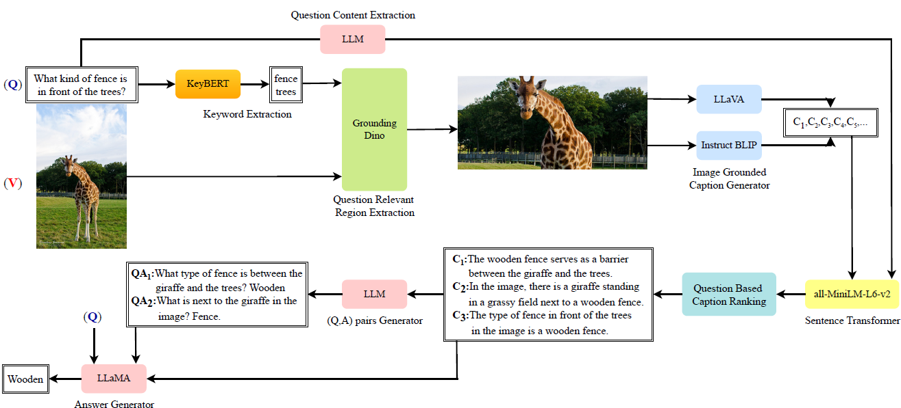
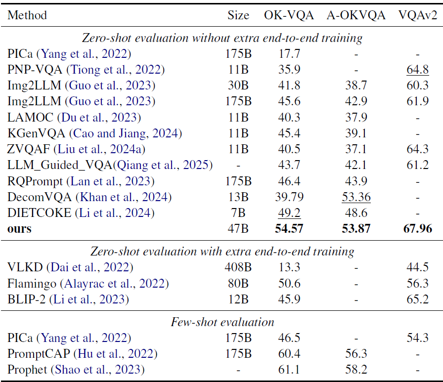

# 🚀 GC-KBVQA: A New Four-Stage Framework for Enhancing Knowledge Based Visual Question Answering Performance

The code of our paper "GC-KBVQA: A New Four-Stage Framework for Enhancing Knowledge Based Visual Question Answering Performance"

## Overview
Knowledge-Based Visual Question Answering (KB-VQA) methods focus on tasks that demand reasoning with information extending beyond the explicit content depicted in the image. Early methods relied on explicit knowledge bases to provide this auxiliary information. Recent approaches leverage Large Language Models (LLMs) as implicit knowledge sources. While KB-VQA methods have demonstrated promising results, their potential remains constrained as the auxiliary text provided may not be relevant to the question context, and may also include irrelevant information that could misguide the answer predictor. We introduce a novel four-stage framework called Grounding Caption-Guided Knowledge-Based Visual Question Answering (GC-KBVQA), which enables LLMs to effectively perform zero-shot VQA tasks without the need for end-to-end multimodal training. Innovations include grounding question-aware caption generation to move beyond generic descriptions and have compact, yet detailed and context-rich information. This is combined with knowledge from external sources to create highly informative prompts for the LLM. GC-KBVQA can address a variety of VQA tasks, and does not require task-specific fine-tuning, thus reducing both costs and deployment complexity by leveraging general-purpose, pre-trained LLMs. Comparison with competing KB-VQA methods shows significantly improved performance.

## Results
This table compares our GC-KBVQA, categorized as zero-shot evaluation without end-to-end training, with competing approaches across three VQA paradigms for SOTA models. The first is zero-shot evaluation without task-specific fine-tuning, leveraging the inherent generalization of pre-trained models. The second involves zero-shot evaluation with end-to-end fine-tuning on task-specific data to improve performance. The third is few-shot evaluation, which uses a small amount of labeled data to refine predictions by combining pre-trained knowledge with limited supervision.

